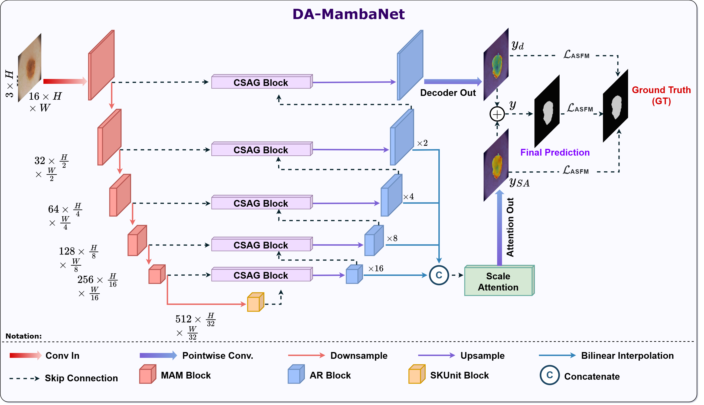
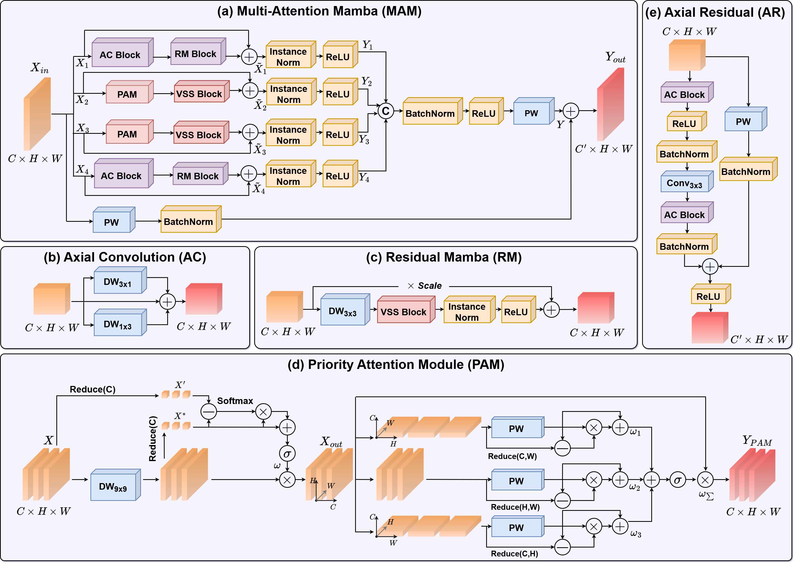
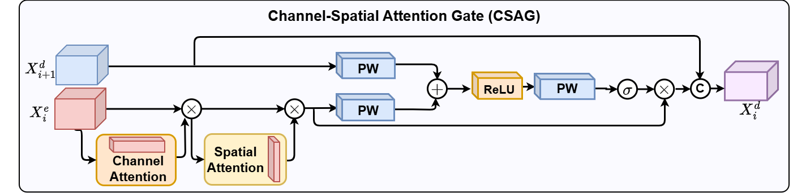
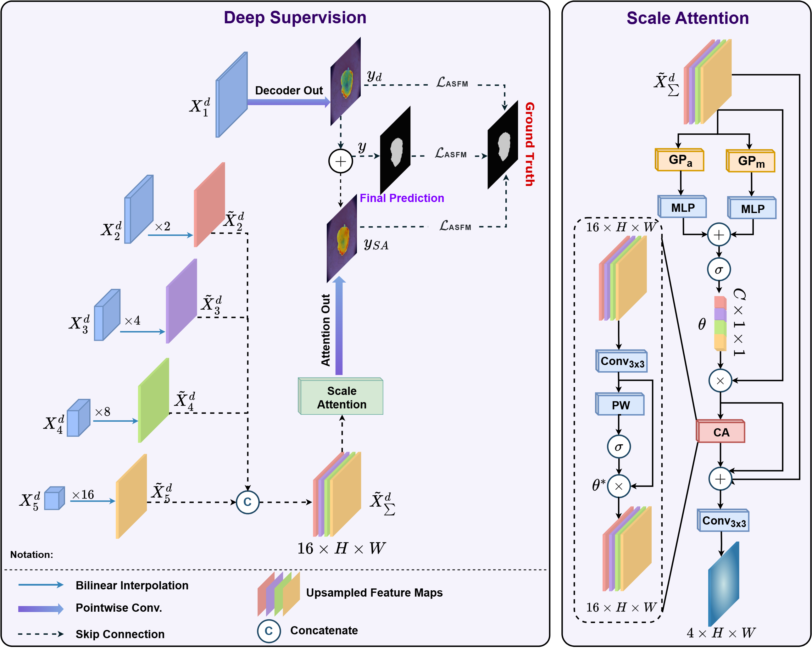
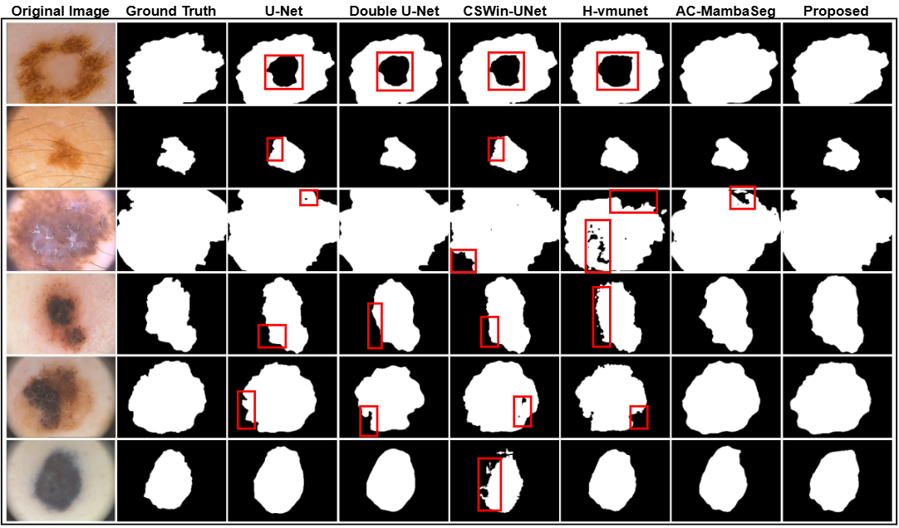
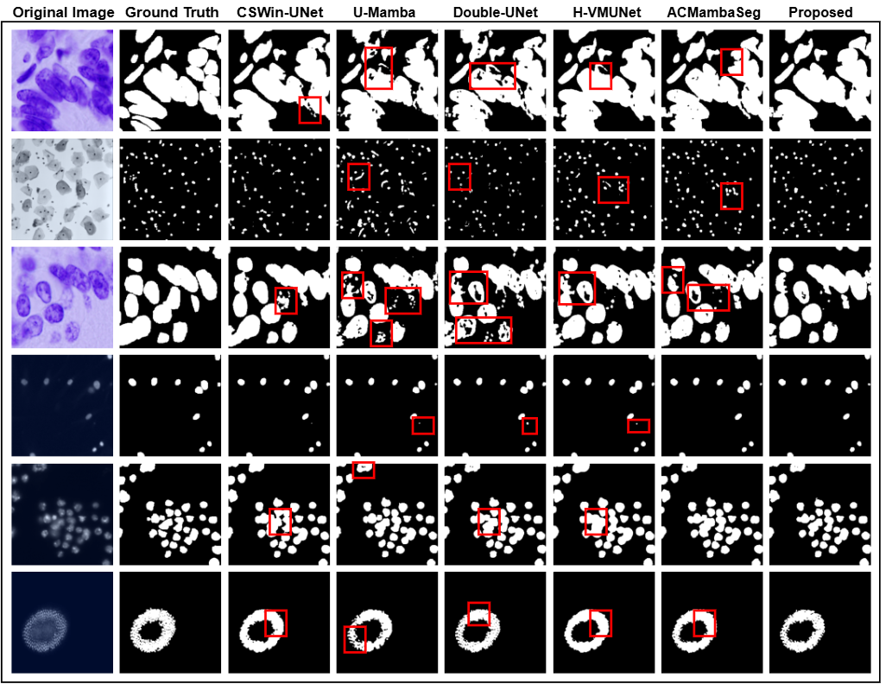
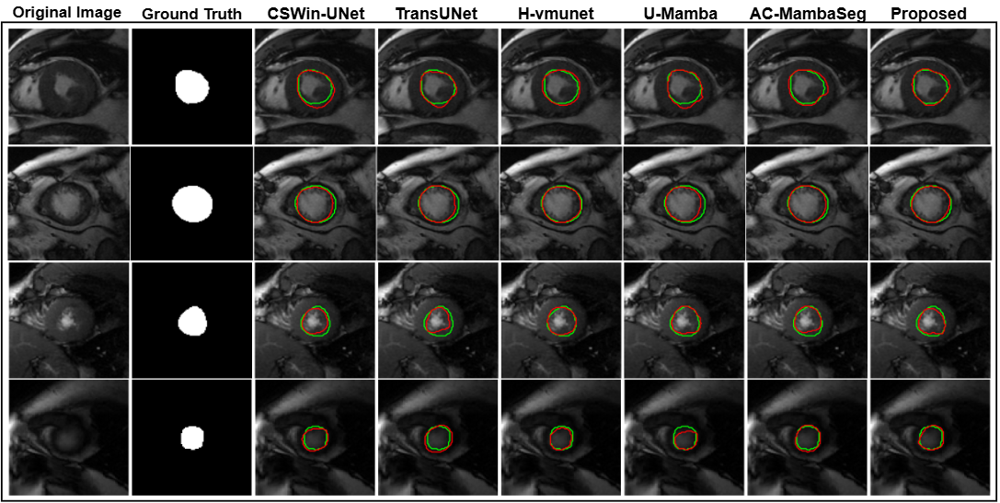
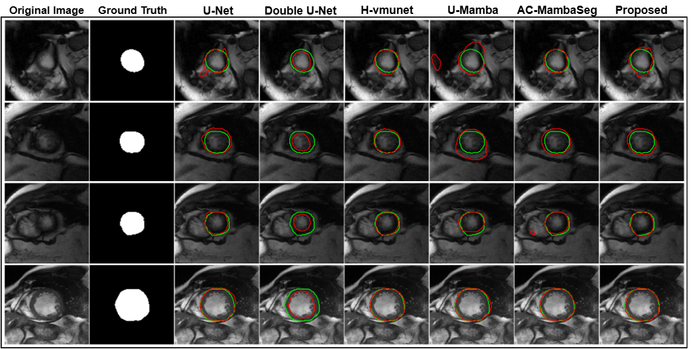
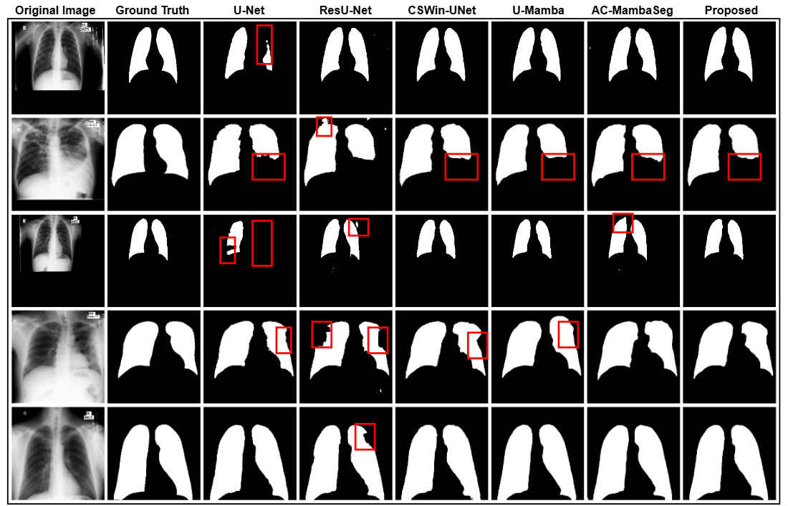

<div align="center">
<h1>DA-MambaNet </h1>
<h3>A dense attention Mamba-based network with Adaptive Sigmoid Fowlkes-Mallows Loss for enhanced medical image segmentation</h3>

Van Quang Nguyen, Thi-Thao Tran, Gia-Bao Truong, Nhu-Linh Than, Ngoc-Khai Hoang, Dinh-Hieu Nguyen, Van-Truong Pham\*


The paper has been accepted by *Image and Vision Computing (IMAVIS)* ([https://doi.org/10.1016/j.imavis.2025.105778](https://doi.org/10.1016/j.imavis.2025.105778)) 


</div>

[](/mnt/data/Quang_imavis.pdf)
[](#installation)
[](#installation)
[](#license)
[](https://github.com/nvquang021/DA-MambaNet/issues)
[](https://github.com/nvquang021/DA-MambaNet)

# Table of Contents
- [Overview](#overview)
- [Key Contributions](#key-contributions)
- [Architecture](#architecture)
- [Datasets](#datasets)
- [Experiment Results](#experiment-results)
- [Installation](#installation)
- [Citation](#citation)
- [Acknowledgments](#acknowledgments)


# Overview
<div style="text-align: justify;">
Medical image segmentation has become an indispensable component in modern healthcare, contributing to improved diagnostic accuracy and enhanced treatment and disease monitoring. Although traditional convolutional neural networks have achieved significant success due to their powerful spatial feature extraction and generalization capabilities, they still face limitations in capturing global context and are computationally expensive. Transformer-based models have been introduced in image segmentation tasks to address these challenges, providing more effective global context learning. Recently, computer vision models based on the Mamba architecture, a new framework proposed to challenge the dominance of Transformers, have emerged. However, most image segmentation models published to date, whether based on traditional convolutional networks, Transformers, or Mamba, continue to face challenges related to high parameter counts and computational demands when striving for effective performance. In this study, we propose a novel end-to-end medical image segmentation model called DA-MambaNet (short for Dense Attention Mamba-based Network). We propose Multi-Attention Mamba (MAM) blocks for feature extraction and Axial Residual (AR) blocks for feature recovery, as well as deep supervision on hidden layers, integrating flexibility in the use of depthwise separable convolutions, comprehensive attention mechanisms, and the Mamba backbone. This approach enables DA-MambaNet to achieve high segmentation performance with significantly reduced parameters and computational cost. Furthermore, we propose the Adaptive Sigmoid Fowlkes-Mallows Loss, which has not been investigated before for image segmentation. The model was validated on several public medical imaging datasets, including PH2, Data Science Bowl 2018, Sunnybrook Cardiac, and Chest X-Ray. The model’s average results on these datasets, as evaluated by metrics such as Dice Score and IoU Score, are as follows: 95.59%, 92.87%, (94.73%, 96.31%), 97.15% and 91.63%, 86.79%, (90.02%, 92.88%), 94.47%. Statistical significance testing with p-values smaller than 0.05 confirms the superior performance of the proposed method compared to other state-of-the-art models. These results demonstrate that DA-MambaNet outperforms previously published segmentation models in terms of key metrics and computational efficiency, requiring only 5.8 million parameters and 1.7 GFLOPs.
</div>

# Key Contributions

> A lightweight, Mamba-CNN hybrid segmentation framework with targeted attention and scale-aware deep supervision.
### 1. Multi-Attention Mamba (MAM)

- **Contribution:** A four-branch feature extractor grouped into two synergistic pairs:  
  (i) **Convolution–Residual–Mamba** for fine-grained local structures;  
  (ii) **Attention–VSS** for long-range/global context.  
  The coupling of locality, residual refinement, and sequence modeling yields richer representations under low complexity.

- **Motivation:** CNNs are strong on local texture but weak on global dependencies; attention/mamba alone can be heavy. MAM jointly captures micro-texture and macro-context efficiently.


### 2. Channel-Spatial Attention Gate (CSAG)

- **Contribution:** A targeted skip-fusion gate that **jointly reweights channels and spatial locations**, suppressing noise and amplifying semantically salient regions during encoder–decoder fusion to improve boundary fidelity.

- **Motivation:** Vanilla skip connections pass redundant/irrelevant details that blur contours. CSAG preserves task-relevant signals to enhance region consistency and edge sharpness.


### 3. Hybrid Loss + Adaptive Sigmoid Fowlkes–Mallows (ASFM) with Scale Attention (Deep Supervision)

- **Contribution:**  
  - A **hybrid loss** blending linear and nonlinear terms via a tunable hyperparameter for stable optimization across class-imbalance regimes.  
  - **ASFM** integrated with **Scale Attention** to **deeply supervise** intermediate decoder layers and **aggregate multi-resolution semantics early**, improving small-object delineation and convergence.

- **Motivation:** Single-objective losses underperform across heterogeneous lesion sizes/scales. Scale-aware deep supervision balances precision/recall and accelerates training.


### 4. Lightweight Mamba-CNN Segmentation Network (Overall System)

- **Contribution:** An **end-to-end** architecture marrying Mamba-based modeling with efficient CNN components, achieving **≈ 5.8 M parameters** and **≈ 1.71 GFLOPs** while delivering strong cross-dataset performance.

- **Motivation:** Clinical deployment requires high accuracy under tight compute/latency budgets. The design achieves transformer-like global reasoning with CNN-level efficiency.


### 5. Empirical Effectiveness (Cross-Dataset)

- **Contribution:** Consistent gains in segmentation accuracy and boundary quality **across multiple medical imaging datasets** under strict parameter/FLOP budgets.

- **Motivation:** Demonstrates robustness and practicality of the proposed modules for diverse, real-world clinical scenarios.


# Architecture
<p align="center">
  
</p>

> ***Fig. 1.** General architecture of the proposed DA-MambaNet, U-shaped model combined with deep supervised hidden layers.*

## **Encoder & Decoder Module:**  
- **Conv–Residual–Mamba (CRM) path**: local detail & long-range modeling.  
- **Parallel attention (PAM/VSS) path**: lightweight attention to enrich context.  
- Axial depthwise separable convolutions with residual connections to reconstruct fine structures.
<p align="center">
  
</p>

> ***Fig. 2.** Architectural illustration of the core modules in the encoder and decoder paths in the DA-MambaNet. (a) Multi-Attention Mamba (MAM) Block: a four-branch module combining Convolution-Residual Mamba and Attention-VSS pairs for complementary feature extraction, (b) Axial Convolution (AC) Block, (c) Residual Mamba (RM) Block, (d) Priority Attention Module (PAM), and (e) Axial Residual (AR).*

## **Skip Connection**  
- Channel and Spatial attention + gating to purify features before concatenation.

<p align="center">
  
</p>

> ***Fig. 3.** Architecture of Channel-Spatial Attention Gate (CSAG), a module selects important information from encoders to pass into the corresponding decoder layers.*

## **Head & Deep Supervision**  
- Multi-scale decoder outputs → upsample → **Scale Attention** → fusion → final segmentation head.
<p align="center">
  
</p>

> ***Fig. 4.** The illustration of our proposed deep supervision mechanism and the architecture of the scale attention module.*

# Datasets

### PH² (Dermoscopic Skin Lesions)
A curated set of **200 dermoscopic images** from Pedro Hispano Hospital (Portugal) with image-level labels and lesion masks, widely used for skin-lesion classification and segmentation benchmarking.  
**Access:** [Official PH² page (University of Porto)](https://www.fc.up.pt/addi/ph2%20database.html)

### Data Science Bowl 2018 (Cell Nuclei Segmentation)
Kaggle benchmark for **automatic nuclei detection/segmentation** across diverse imaging conditions and cell types; includes annotations and competition splits.  
**Access:** [Kaggle – 2018 Data Science Bowl (Data tab)](https://www.kaggle.com/competitions/data-science-bowl-2018/data)

### Sunnybrook Cardiac Data (LV Segmentation, Cine-MRI)
MICCAI 2009 LV Segmentation Challenge dataset with **45 cine-MRI cases** spanning multiple cardiac pathologies; expert contours at ED/ES phases.  
**Access:** [Cardiac Atlas Project – Sunnybrook Cardiac Data](https://www.cardiacatlas.org/sunnybrook-cardiac-data/)

### Chest X-ray (Shenzhen & Montgomery; Lung Segmentation)
Public CXRs with **paired lung masks** from Shenzhen No. 3 People’s Hospital (CN) and Montgomery County (US); commonly used for lung segmentation and TB screening research.  
**Access:** [Shenzhen & Montgomery datasets](https://data.lhncbc.nlm.nih.gov/public/Tuberculosis-Chest-X-ray-Datasets/)

#  Experiment Results
###  Quantitative Results
> Full details in the paper: [Link paper](https://doi.org/10.1016/j.imavis.2025.105778)

| Dataset       | Metric (↑) | DA-MambaNet (ours) | Notes |
|---------------|------------|--------------------|-------|
| PH2           | Dice / IoU | **95.59 $\pm$ 1.22 / 91.63 $\pm$ 3.01**  | Strong boundary fidelity; robust to lesion size variance. |
| DSB2018       | Dice / IoU | **92.87 $\pm$ 2.21 / 86.79 $\pm$ 3.82**  | Balanced precision/recall; reduced over-/under-seg. |
| SB Endo   | Dice / IoU | **94.73 $\pm$ 0.92 / 90.02 $\pm$ 1.16**  | Efficient with cardiac structures; competitive vs heavier baselines. |
| SB Epi   | Dice / IoU | **96.31 $\pm$ 1.09 / 92.88 $\pm$ 2.01**  | Efficient with cardiac structures; competitive vs heavier baselines. |
| Chest X-ray   | Dice / IoU | **97.15 $\pm$ 0.70 / 94.47 $\pm$ 1.31**  | High mean Dice (>97% in our setting); stable across views. |


###  Qualitative Results

This section showcases representative qualitative results on each dataset. Replace the placeholders below with your exported figures. All images are stored under `images/Visualization/`.  

---

 
> ***Fig. 5:** Visualization of the segmentation results of PH² dataset for the top 5 best-performing comparison models and the proposed DA-MambaNet model.*

---


> ***Fig. 6:** Visualization of the segmentation results of DSB2018 dataset for the top 5 best-performing comparison models and the proposed DA-MambaNet model.*
 
---


> ***Fig. 7:** Visualization of segmentation results on Sunnybrook Dataset, showcasing the top 5 best-performing comparison models alongside the proposed DA-MambaNet model. Green contours present the ground truth and red contours indicate the predictions. (For interpretation of the references to color in this figure legend, the reader is referred to the web version of this article.)*
---

> ***Fig. 8:** Visualization of the segmentation results of Chest X-Ray dataset for the top 5 best-performing comparison models and the proposed DA-MambaNet model.*

# Installation
```bash
pip install torch==2.4.0 torchvision==0.19.0 torchaudio==2.4.0 --index-url https://download.pytorch.org/whl/cu121
!pip install causal-conv1d==1.4.0 && pip install mamba-ssm==2.2.2
pip install einops
pip install timm
pip install pytorch_lightning >> dev null
pip install fvcore >> dev null
```
Install project dependencies:
```bash
pip install -r requirements.txt
```
# Project Structure

```
DA-MambaNet/
├── README.md                           # Project overview, environment setup, configs, citation & license
├── requirements.txt                    # Reproducible package pins (PyTorch, Lightning, timm, mamba-ssm, etc.)
├── images/
│   ├── modules/
│   │   ├── CSAG.png                    # Channel–Spatial Attention Gate schematic for skip fusion
│   │   ├── DA_MambaNet.png             # End-to-end architecture diagram of DA-MambaNet
│   │   ├── DeepSupervision.png         # Scale-aware deep supervision/decoder connection
│   │   └── Modules.png                 # Summary of core building blocks used in the model
│   └── Visualization/
│       ├── DSB2018.png                 # Qualitative predictions on DSB2018 nuclei
│       ├── PH2.png                     # Qualitative predictions on PH² skin lesions
│       ├── ChestXRay.png               # Lung segmentation overlays on CXR
│       ├── epi.png                     # Epicardium contour example (Sunnybrook)
│       └── endo.png                    # Endocardium contour example (Sunnybrook)
│
├── configs/                            # Dataset/model/training YAMLs; paths, augments, hparams, metrics
│   ├── ph2.yaml                        # PH²: splits, preprocessing (e.g., 192×256), losses/metrics
│   ├── dsb2018.yaml                    # DSB2018: aug pipeline, 256×256 input, eval protocol
│   ├── sunnybrook.yaml                 # Sunnybrook: ED/ES handling, endo/epi targets, 160×160
│   └── chestxray.yaml                  # Shenzhen/Montgomery: pairing rules, 256×256, test-only set
│
├── src/
│   ├── models/
│   │   ├── modules/                    # Atomic blocks composing backbone/decoder/heads
│   │   │   ├── AxialResidualBlock.py   # Residual conv for efficient context capture
│   │   │   ├── CSAG.py                 # Channel–Spatial gating on skip connections to suppress noise
│   │   │   ├── MultiAttentionMamba.py  # Four-branch MAM extractor (Conv-Residual-Mamba + Attention-VSS)
│   │   │   ├── ScaleAttention.py       # Scale attention for feature aggregation and deep supervision taps
│   │   │   ├── SelectiveKernels.py     # Adaptive kernel selection to vary receptive field on-the-fly
│   │   │   └── VSS_block.py            # Visual State-Space/Mamba block for long-range dependencies
│   │   ├── DA_MambaNet.py              # Full network 
│   │
│   ├── data/                           # PyTorch Dataset/Dataloader implementations per dataset
│   │   ├── PH2/PH2_dataloader.py         
│   │   ├── DSB2018/DSB2018_dataloader.py 
│   │   ├── Sunnybrook/Sunnybrook_dataloader.py 
│   │   └── ChestXray/Lung_dataloader.py  
│   │
│   ├── trainer/
│   │   ├── evaluate_model.py           # Offline evaluation on checkpoints; saves metrics/curves/figures
│   │   ├── segmentor.py                # LightningModule: forward, losses (hybrid+ASFM), optimizer, logging
│   │   └── train.py                    # CLI entry: parse YAML, seed, callbacks, checkpointing, multi-GPU
│   │
│   └── utils/
│       ├── LossFunctions.py            # Hybrid loss + Adaptive Sigmoid Fowlkes–Mallows; auxiliary terms
│       ├── metrics.py                  # Dice, IoU/Jaccard, Precision/Recall, optional HD95/ASSD
│       └── visualization.py            # Inference overlays, color maps, grid savers, sample exporters
│
└── LICENSE                             # Chosen license (e.g., MIT/Apache-2.0); referenced in README

```
# Citation


If you use this repository or build upon our methods, we would be grateful if you could kindly cite this work:

```bibtex
@article{NGUYEN2025105778,
title = {A dense attention Mamba-based network with Adaptive Sigmoid Fowlkes-Mallows Loss for enhanced medical image segmentation},
journal = {Image and Vision Computing},
volume = {163},
pages = {105778},
year = {2025},
issn = {0262-8856},
doi = {https://doi.org/10.1016/j.imavis.2025.105778},
url = {https://www.sciencedirect.com/science/article/pii/S026288562500366X},
author = {Van Quang Nguyen and Thi-Thao Tran and Gia-Bao Truong and Nhu-Linh Than and Ngoc-Khai Hoang and Dinh-Hieu Nguyen and Van-Truong Pham}
}
```
#  Acknowledgments
This project was conducted under the guidance of **IPSAL Lab** (Image Processing and Signal Analysis Laboratory).
I am deeply grateful for the lab’s support, insightful discussions, and constructive feedback throughout the project.

<p align="center">
  <a href="https://www.facebook.com/profile.php?id=61556369235996" target="_blank" rel="noopener noreferrer">
    
  </a>
</p>


> If this project proves useful in your work, kindly ⭐ star the repository in support. [](https://github.com/nvquang021/DA-MambaNet)


